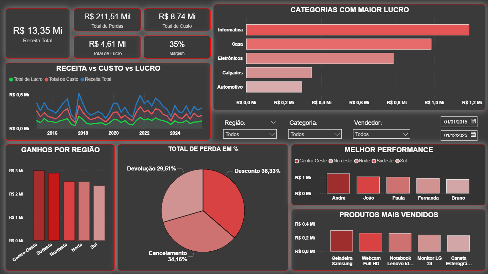
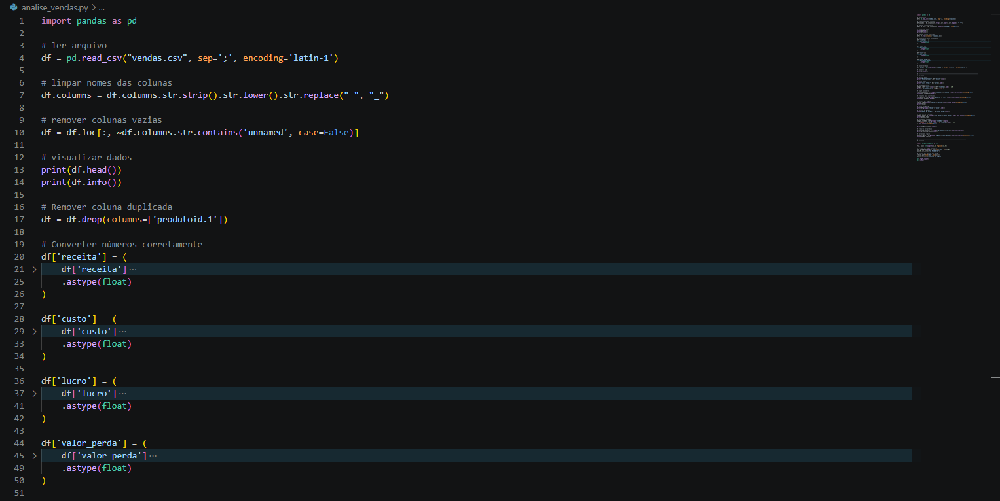
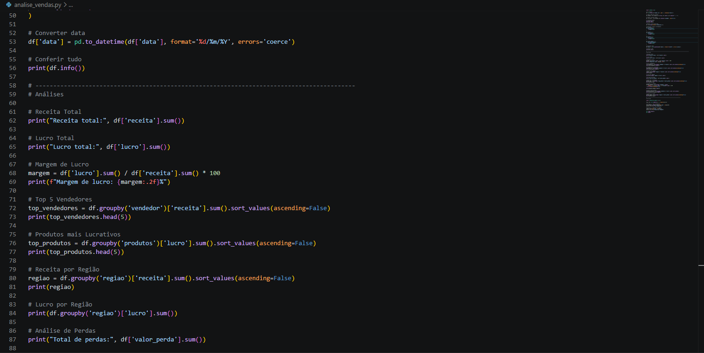
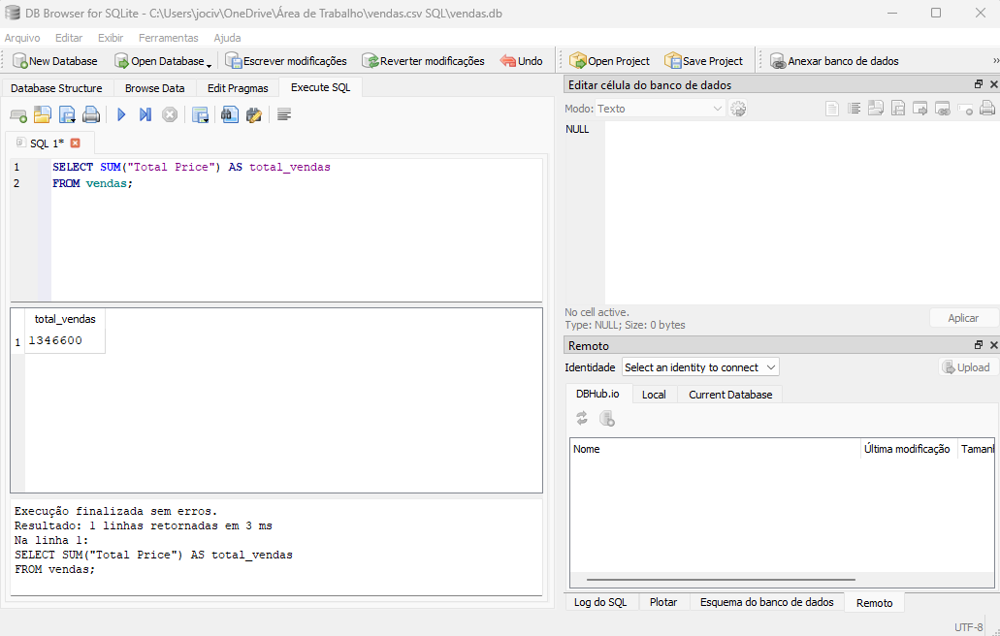
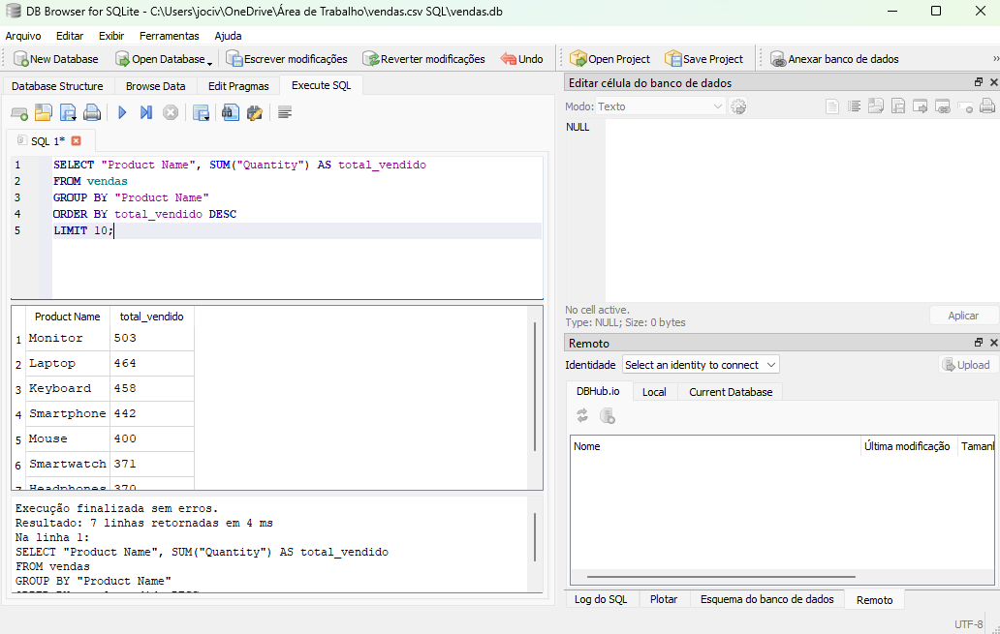
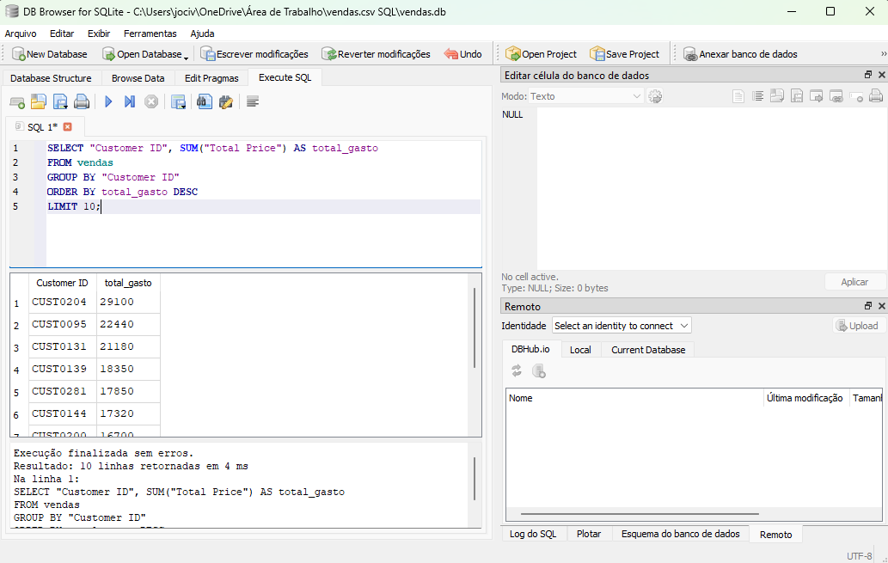
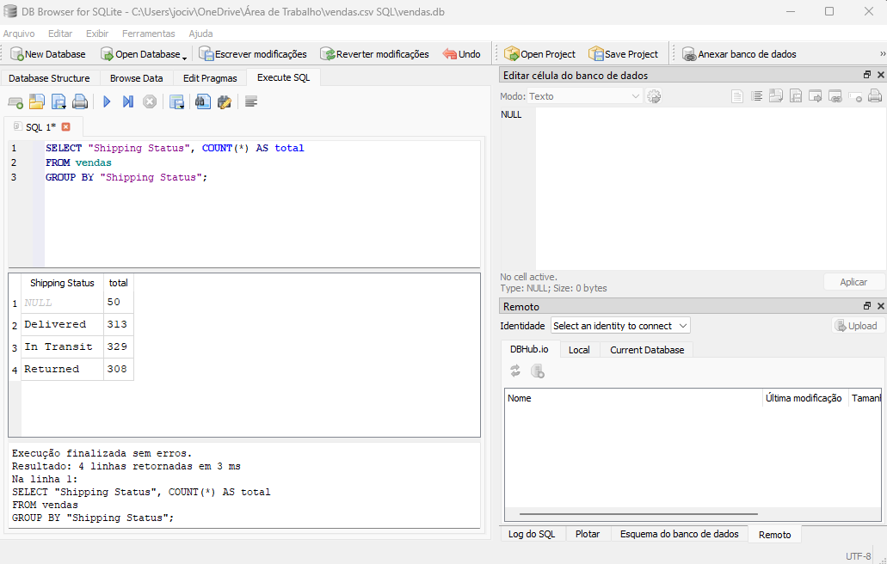
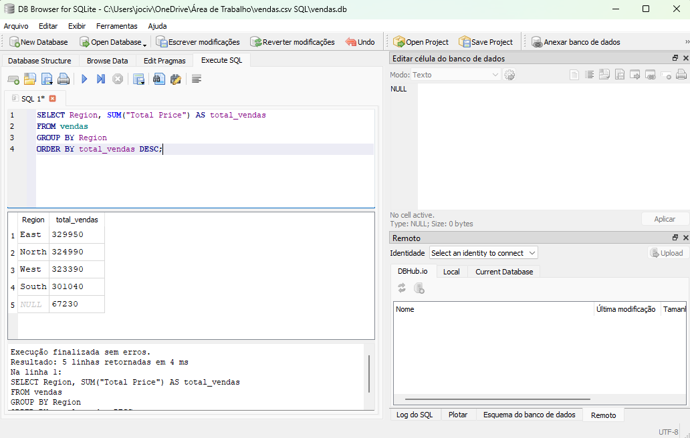

# 👨‍💻 Jocival Almeida  
📊 Analista de Dados | Business Intelligence  

📍 São Paulo - SP  
🎯 Foco em transformar dados em decisões estratégicas  

---

## 🚀 Projetos em Destaque

### 📊 Dashboard Estratégico de Vendas e Performance (Power BI)

  

📌 Dashboard completo com foco em desempenho comercial, lucratividade e identificação de perdas.

**🔍 Principais análises:**
- Receita vs Custo vs Lucro ao longo do tempo  
- Análise de perdas (cancelamentos, devoluções e descontos)  
- Performance de vendedores por região  
- Produtos mais vendidos e categorias mais lucrativas  

**💡 Principais insights:**
- Descontos são o maior fator de perda de receita  
- Forte dependência de poucos produtos  
- Diferença relevante entre vendedores  
- Regiões com eficiência operacional distinta  

**🛠️ Tecnologias:**  
Power BI | DAX | Modelagem de Dados  

🔗 [Acessar projeto](https://github.com/asjocival/dashboard-completo-vendas-1-power-BI.git)

---

### 📊 Análise de Vendas com Python

  
  

## 🎯 Objetivo

Realizar uma análise exploratória de dados (EDA) para identificar padrões, oportunidades e problemas que impactam diretamente os resultados financeiros da empresa.

## 📊 Análises Realizadas

* Receita total e lucro total
* Margem de lucro
* Ranking dos vendedores por receita
* Produtos mais lucrativos e menos rentáveis
* Análise de perdas financeiras
* Receita por região  

## 🛠️ Ferramentas Utilizadas

* Python
* pandas
* matplotlib

## 💡 Principais Insights

* A receita está concentrada em poucos vendedores, indicando dependência comercial
* Alguns produtos apresentam prejuízo, sugerindo necessidade de revisão de preços ou custos
* As perdas estão concentradas em regiões específicas, indicando possíveis falhas operacionais
* Nem todos os vendedores com alta receita possuem boa margem, indicando ineficiência em algumas vendas

🔗 [Acessar projeto](https://github.com/asjocival/Analise-Vendas-Python.git)

---

### 🧾 Análise de Vendas com SQL

  
  
  
  
  

📌 Exploração de dados para identificação de padrões de consumo.

**🔍 Análises:**
- Produtos mais vendidos  
- Clientes mais relevantes  
- Segmentação de dados  

🔗 [Acessar projeto](https://github.com/asjocival/sql-analise-vendas.git)

---

## 📊 Outros Projetos

- 🔗 [Dashboard Vendas e Logística](https://github.com/asjocival/dashboard-analise-de-vendas-e-logistica.git)  
- 🔗 [Dashboard Omnichannel](https://github.com/asjocival/dashboard-analise-de-vendas-omnichannel.git)  
- 🔗 [Dashboard com Atualização Automática](https://github.com/asjocival/dashboard-vendas-atualizacao-automatica-com-planilha-excel.git)  
- 🔗 [Dashboard Posto de Gasolina](https://github.com/asjocival/dashboard-posto-de-gasolina.git)  
- 🔗 [Dashboard Vendas 1](https://github.com/asjocival/Dashboard-de-Vendas-no-Power-BI.git)    

---

## 💡 Sobre mim

Sou estudante de Ciência da Computação em transição para a área de dados, com foco em:

- 📊 Análise de Dados  
- 📈 Business Intelligence  
- 📉 Visualização de Dados  

Busco oportunidades para aplicar dados na geração de valor para o negócio.

---

## 📫 Contato

- 💼 [LinkedIn](https://www.linkedin.com/in/jocival-almeida-9a724336b)  
- 📧 as.jocival@gmail.com  
- 📱 (11) 96579-6229  
